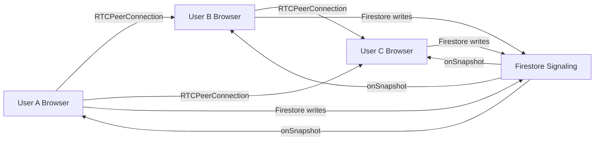

# Live Check-in Feature — Walkthrough

## What Was Built

A multi-peer mesh WebRTC video/audio "Live Check-in" for TaskTrove communities, with all signaling done via Firestore (no backend server needed).

## Files Changed

| File | Action | Description |
|------|--------|-------------|
| [liveCheckinWebrtc.ts](file:///Users/shrishesha/Developer/tasktrove/src/lib/liveCheckinWebrtc.ts) | **NEW** | [LiveCheckinRoomManager](file:///Users/shrishesha/Developer/tasktrove/src/lib/liveCheckinWebrtc.ts#79-630) class — full mesh WebRTC with Firestore signaling |
| [LiveCheckinDialog.tsx](file:///Users/shrishesha/Developer/tasktrove/src/components/communities/LiveCheckinDialog.tsx) | **REWRITE** | Multi-peer video dialog with pre-join screen, responsive grid, controls |
| [page.tsx](file:///Users/shrishesha/Developer/tasktrove/src/app/communities/%5Bid%5D/page.tsx) | **MODIFY** | Pass `communityId={id}` to LiveCheckinDialog |
| [firestore.rules](file:///Users/shrishesha/Developer/tasktrove/firestore.rules) | **MODIFY** | Added `liveRooms/{roomId}/participants` + [signals](file:///Users/shrishesha/Developer/tasktrove/src/lib/liveCheckinWebrtc.ts#73-76) security rules |

## Architecture Overview



- **Mesh topology**: N-1 connections per user, practical limit ~6 users
- **Deterministic offer direction**: lower UID sends the offer (prevents duplicate offers)
- **Heartbeat**: `lastActive` updated every 30s, stale peers (>60s) are cleaned up
- **ICE**: Google free STUN servers (no TURN — may fail behind restrictive NATs)

## Firestore Data Structure (new)

```
communities/{communityId}/liveRooms/{roomId}/
  ├─ participants/{userId}    → { displayName, avatarUrl, joinedAt, lastActive }
  └─ signals/{autoId}         → { type, from, to, payload, createdAt }
```

## Verification

### Typecheck

`npm run typecheck` passes with **0 new errors**. The 7 errors reported are all pre-existing (Next.js 15 params typing and AppLayout issues).

### Manual Testing

To test locally:
1. Run `npm run dev` (starts on port 9002)
2. Open two browser windows, each logged in as a different user
3. Navigate to the same community → **Live Check-ins** tab
4. Click **Start a Check-in** in both → grant camera/mic
5. Confirm both see each other's video tiles
6. Test mute, video-off, and leave buttons

> [!NOTE]
> For testing across networks, a TURN server would be needed. localhost testing works peer-to-peer without one.
